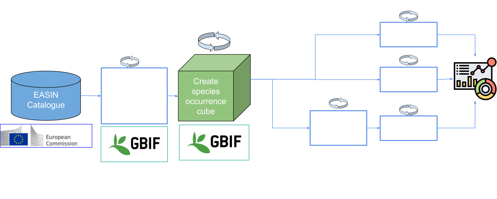

---
format:
  html:
    page-layout: full
    theme: darkly
---

## Data

```{r}
#| echo: false
#| message: false
#| warning: false
#| include: false
#| results: "hide"
library(readr)
library(dplyr)
library(assertthat)
download_key <- readr::read_csv(
    "https://raw.githubusercontent.com/guardias-eu/emtrends/refs/heads/main/data/output/last_cube_key.csv",
    show_col_types = FALSE,
    na = "") %>%
    dplyr::pull(last_cube_key)
assertthat::assert_that(
    length(download_key) == 1,
    msg = "Expected exactly one download key in the last_cube_key.csv file."
)
```

Everything shown by this dashboard starts with the [GBIF species occurrence cube](https://www.gbif.org/occurrence-cubes) with download key: 
[``r download_key``](`r file.path("https://www.gbif.org/occurrence/download", download_key)`).

## Workflow

{fig-align="center"}

